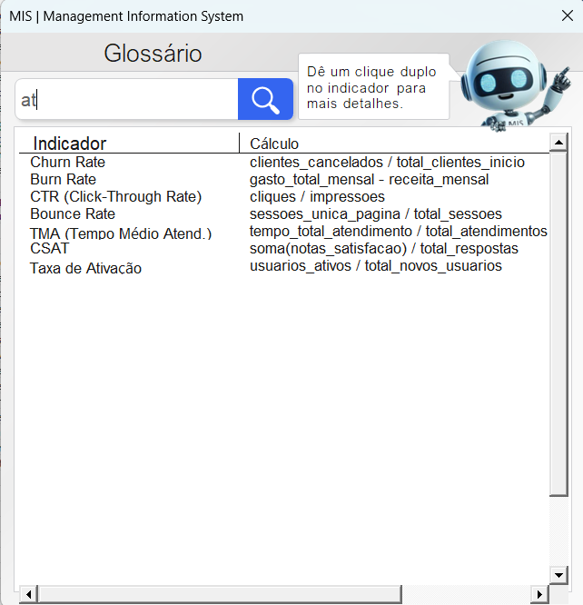
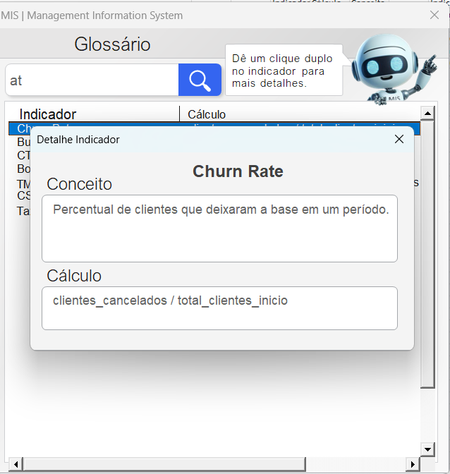

# 📚 Glossário de Indicadores & Métricas (MIS)

> Uma ferramenta desenvolvida em VBA para padronizar e agilizar a consulta de conceitos, cálculos e indicadores dos relatórios gerenciais.

---

## 🎯 Sobre o Projeto
Este projeto soluciona um problema comum em áreas de dados e MIS: a descentralização do conhecimento. O **Glossário** funciona como uma "fonte da verdade", permitindo que qualquer analista ou gestor consulte rapidamente como um indicador é calculado, garantindo consistência nos relatórios.

O diferencial deste sistema é sua interface amigável (UserForm) que opera de forma não-obstrutiva sobre o Excel.

## ✨ Funcionalidades Principais

### 🔍 1. Busca Avançada (Estilo SQL Like)
Diferente de filtros comuns que exigem o início da palavra, o sistema utiliza uma lógica de busca similar ao `LIKE '%texto%'`.
* **Exemplo:** Ao digitar **"at"**, o sistema traz "Voz - **At**endidas", "Chat - Bot **At**endidas" e "**At**endidas até 20s".
* A filtragem ocorre em tempo real enquanto o usuário digita.

### 📋 2. Visualização em Dois Níveis
* **Nível 1 (Lista Geral):** Exibe o **Indicador** e o **Cálculo** de forma resumida para consulta rápida.
* **Nível 2 (Detalhes):** Ao dar um **clique duplo** em um item da lista, abre-se um modal de detalhes exibindo o **Conceito** completo (definição de negócio) e a fórmula isolada.

### ⚡ 3. Multitarefa (Non-Modal)
O formulário foi configurado com a propriedade `ShowModal = False`.
* **Benefício:** Isso permite que o usuário **continue clicando, copiando e editando células na planilha** mesmo com o Glossário aberto. Não é necessário fechar a janela para trabalhar.

---

## 📸 Screenshots

<p align="center">
  
  <br>
  <em>Tela Principal: Busca dinâmica filtrando por trechos de texto ("at").</em>
</p>

<p align="center">
  
  <br>
  <em>Tela de Detalhes: Acionada por clique duplo, exibindo o conceito de negócio.</em>
</p>

---

## 🛠️ Estrutura do Repositório

O projeto segue uma arquitetura organizada para facilitar a manutenção e versionamento:

```text
/meu-projeto
│
├── /docs                  # Documentação de problemas enfrentados e solução aplicada
│   ├── compatibilidade-dpi.md
│   └── /img               # Imagens da documentação e README
│
├── /assets                # Recursos de Design
│   └── /design            # Layouts editáveis (PPTX)
│   └── /img               # Imagens do README