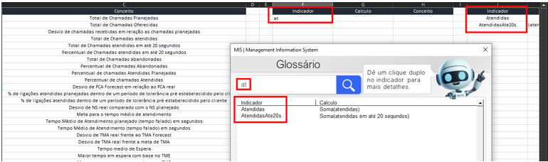
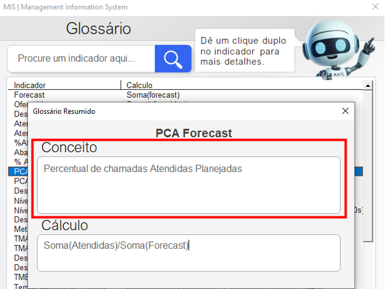

## 1.3 Como Usar os Scripts de Módulos e Formulários em VBA

Após a importação dos arquivos para o seu projeto, é fundamental configurar a estrutura da planilha para que o código VBA interaja corretamente com os dados.

### Configuração da Sheet "Glossario"
É necessário criar uma aba (sheet) e definir o seu **nome interno no VBA** (CodeName) como `Glossario`.

> **Nota:** O nome interno é alterado na janela de propriedades do VBE, não é apenas renomear a aba no Excel.

*Imagem 3 – Configuração do Nome interno (CodeName) no VBA.*

### Padrão de Colunas Obrigatório
Para o funcionamento correto dos filtros e formulários, esta aba deve seguir rigorosamente a estrutura de colunas abaixo:

#### 1. Base de Dados (Entrada)
Local onde os dados ficam armazenados permanentemente.
* **Colunas A1, B1 e C1** devem conter, respectivamente, os títulos:
    * **Indicador**
    * **Cálculo**
    * **Conceito**
* **Ação:** Preencha os dados (linhas abaixo) conforme cada título.

#### 2. Critérios de Busca (Intermediário)
Área usada pelo formulário para escrever o que o usuário está digitando na busca.
* **Colunas F1, G1 e H1** devem conter, respectivamente, os títulos:
    * **Indicador**
    * **Cálculo**
    * **Conceito**
* **Ação:** Não alterar manualmente. Essas células são preenchidas automaticamente pelo VBA durante a digitação no formulário.

*Imagem 4 – Execução e aplicação dinâmica do campo de busca.*

#### 3. Área de Resultados (Saída)
Local onde o "Filtro Avançado" do VBA despeja os dados encontrados.
* **Colunas J1, K1 e L1** devem conter, respectivamente, os títulos:
    * **Indicador**
    * **Cálculo**
    * **Conceito**
* **Ação:** Não alterar. Aqui será exibido o resultado filtrado que alimenta a ListBox do formulário.

### Visualização de Detalhes
A coluna de **Conceito** não aparece na listagem principal para economizar espaço. Ela é exibida exclusivamente no **segundo formulário**, que é acionado através de um **clique duplo** sobre qualquer indicador listado.

*Imagem 5 – Exibição do conceito detalhado no segundo formulário.*